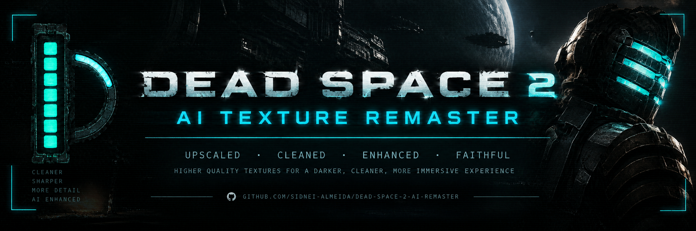

<p align="center"></p>

<h1 align="center">Dead Space 2 AI Texture Remaster</h1>

<p align="center"><b>Remaster every Dead Space 2 texture with open source AI, on your own GPU. One command, then walk away.</b><br>
Linux · Intel Arc · NVIDIA · PyTorch · Works with DS2TexInject</p>

<p align="center">
  
  
  
  
</p>

<p align="center"><i>"Twinkle, twinkle, little star..."</i> The Sprawl, rebuilt one texel at a time.</p>

<p align="center">🇧🇷 <b><a href="README.pt-BR.md">Leia em português →</a></b></p>

---

## What is this?

Dead Space 2 came out in 2011, and most of its textures are 128 to 512 pixels wide, squeezed with DXT compression. Up close, walls turn to mush and metal looks like blocky paint.

**This tool remasters them with AI.** It takes the original textures straight from the game, runs each one through an upscaler trained on old game textures, and packs the result so the game loads it in place of the original. No game files are modified, and one key (**F10**) switches between original and remaster while you play.

- 🧠 **Open source AI, running locally.** Default model: [4x-PBRify_UpscalerV4](https://openmodeldb.info/models/4x-PBRify-UpscalerV4), made for 2000s game textures and licensed CC0.
- 🎨 **Faithful to the original.** A color lock keeps the original colors and lighting; the AI only adds fine detail. No redesigns, no hallucinated logos.
- 🧩 **Your mods come first.** Textures already covered by your `.tpf` packs (4K suits, Return to Titan...) are skipped and stay exactly as their authors made them.
- 🛌 **Set and forget.** One command does everything, survives GPU hangs, resumes where it stopped and sends a desktop notification when it is done.

---

## Quick start

| Step | What to do |
|:---:|---|
| 1 | Install **[DS2TexInject](https://github.com/sidnei-almeida/dead-space-2-texmod-linux)**. It loads the textures into the game. |
| 2 | Clone this repo and run **`./remaster.sh setup`**. |
| 3 | Run **`./remaster.sh dump-on`** and **play** for a while. The game hands over its textures. |
| 4 | Close the game and run **`./remaster.sh`**. Go get a coffee. |
| 5 | **Play.** Press **F10** to compare before and after. |

Each step is explained below.

---

## Step 1: Install DS2TexInject

This project creates the textures. **[DS2TexInject](https://github.com/sidnei-almeida/dead-space-2-texmod-linux)** is the plugin that puts them in the game, and it also collects the original textures for the AI.

<a href="https://github.com/sidnei-almeida/dead-space-2-texmod-linux"></a>

Follow its guide until the game runs with it. Your `.tpf` packs are optional, but they are respected if you have them.

## Step 2: Install this tool

```sh
git clone https://github.com/sidnei-almeida/dead-space-2-ai-remaster
cd dead-space-2-ai-remaster
./remaster.sh setup
```

`setup` creates a Python environment in `.venv`, installs PyTorch and [spandrel](https://github.com/chaiNNer-org/spandrel), downloads the AI model and tells you which GPU it found:

```
GPU: Intel(R) Arc(TM) B580 Graphics
```

> **Intel Arc:** PyTorch also needs Intel's compute driver. On Arch: `sudo pacman -S intel-compute-runtime level-zero-loader`
>
> **NVIDIA:** edit the PyTorch line in `cmd_setup` inside `remaster.sh` to use the regular `pip install torch torchvision`.
>
> **No supported GPU:** it falls back to the CPU. It works, just much slower.

## Step 3: Collect the textures

The AI works on the textures exactly as the game uses them, so the game has to hand them over:

```sh
./remaster.sh dump-on
```

Now **play normally.** Every texture that shows up on screen is saved once to `texmod/_dump/`. The game may hiccup a little while it saves.

You don't need to finish the game. Most textures (UI, Isaac, weapons, Necromorphs, common walls) load in the first minutes, and after that only new areas add more. In testing, **25 minutes of play gave 4,375 textures.** Chapter saves are a quick way to visit every area.

When you're done:

```sh
./remaster.sh dump-off
```

## Step 4: Remaster

Close the game and run:

```sh
./remaster.sh
```

That's it. It reads the dump, runs the AI, builds the DDS files, packs them and installs them in the game. You can leave it alone:

- ⏱️ **The first run takes a while** (about 1 to 2 hours on an Intel Arc B580). Later runs only process textures that are new in the dump.
- 🔁 **Stop anytime** with Ctrl+C. Run it again and it continues where it stopped.
- 🛡️ **If the GPU hangs**, it notices the missing progress, restarts and carries on.
- 🎮 **If you open the game mid-run**, it stops instead of fighting the game for the GPU.
- 🔔 **A desktop notification** tells you when it's done.

Check on it from another terminal:

```
$ ./remaster.sh status
upscale [#########...........] 46.2%  1422/3079
decorrido 31m05s | faltam ~36m12s | erros 0 | modelo 4x-PBRify_UpscalerV4.pth
por classe: diffuse 702, mask 611, normal_ag 109
situacao: RODANDO
```

## Step 5: Play

Launch Dead Space 2 from Steam as usual.

- Press **F10** to toggle between original and remastered textures.
- Walk up to walls, floors and doors with your flashlight on. That's where the difference shows.

---

## All commands

| Command | What it does |
|---|---|
| `./remaster.sh` | Processes new textures and installs the result in the game. |
| `./remaster.sh status` | Progress, time left and errors of a running job. |
| `./remaster.sh dump-on` / `dump-off` | Starts or stops collecting textures while you play. |
| `./remaster.sh off` | Turns the remaster off (only your `.tpf` packs stay). |
| `./remaster.sh on` | Turns it back on. |
| `./remaster.sh setup` | Installs or repairs the environment and downloads the model. |

## Settings

They live at the top of `remaster.sh`:

| Setting | Default | What it does |
|---|---|---|
| `MODEL` | `4x-PBRify_UpscalerV4` | Any model [spandrel](https://github.com/chaiNNer-org/spandrel) can load: ESRGAN, SPAN, DAT, HAT... Browse [OpenModelDB](https://openmodeldb.info). |
| `SCALE` | `4` | Upscale factor for color textures and normal maps. |
| `MASK_SCALE` | `2` | Factor for masks, specular and light maps. They gain little and use a lot of memory. |
| `MAX_SIZE` | `2048` | Largest side of any texture. |
| `WORK` | `work/pbrify4x` | Working folder. Change it when you change the model, so results don't mix. |

---

## Troubleshooting

| Problem | Fix |
|---|---|
| **`GPU: NAO ENCONTRADA`** | PyTorch can't see the GPU. On Intel Arc, install `intel-compute-runtime` and `level-zero-loader`. |
| **The game crashes when entering new areas, or after a long session** | Dead Space 2 is a 32-bit program and can run out of memory. Lower `SCALE` to `2` or `MAX_SIZE` to `1024`, run `./remaster.sh` again, or set `Pool=default` in `DS2TexInject.ini`. |
| **Some texture looks wrong** | Press **F10** to confirm. Open `work/pbrify4x/preview.html`, find it, and add its hash to `work/pbrify4x/rejected.txt`. The next run leaves it out. |
| **The game stutters when entering new areas** | Make sure DS2TexInject is up to date and Pillow is installed (`sudo pacman -S python-pillow`), then run `./remaster.sh on`. Textures will be loaded game-ready. |
| **Anything else** | Check `work/pbrify4x/remaster.log` and open an issue with it. |

<p align="center"><a href="https://github.com/sidnei-almeida/dead-space-2-ai-remaster/issues"></a></p>

---

## How it works

You don't need this part to use the tool.

```
the game (DumpTextures=1) ──► texmod/_dump/0xHASH.dds        original textures, named by their TexMod hash
        │
        ▼  scan        sort each texture: color, normal map, mask, too small, single color
        ▼  upscale     AI for color textures, careful resampling for normal maps and masks
        ▼  encode      back to the original format (DXT1, DXT5, ARGB) with a full mipmap chain
        ▼  pack        texmod/zz_ai_remaster.zip  (+ texmod.def)
        ▼  ds2tex.py   texmod/_cache, where DS2TexInject finds it while you play
```

**Every kind of texture gets its own treatment:**

| Kind | What happens |
|---|---|
| Color (diffuse) | AI upscale with wrap padding so tiling textures don't get seams, then a color lock: low frequencies come from the original, so colors and lighting stay true. |
| Normal map (DXT5nm, X in alpha and Y in green) | Never goes through a photo model. Resampled, renormalized, and the unused red and blue channels are kept as the game expects. |
| Masks, specular, light maps | Clean resampling. AI would create seams between light map patches. |
| Alpha | Upscaled separately. In DXT1 it goes back to 1-bit cut-outs (grates, foliage). |
| Tiny or single-color | Skipped. Nothing to gain. |

**Why the original textures come from the running game:** DS2TexInject finds textures by the CRC32 hash of the bytes the game sends to Direct3D. Dumping at runtime gives every file the right name for free. Pulling them out of EA's `.DAT` archives would mean reverse engineering the format and still reproducing the exact hash.

**Why mipmaps matter:** without them, the plugin would build mipmaps the first time each texture appears, in the middle of the game. Dozens of 2048px textures at once meant drops from 100 to 40 FPS when entering a new area. Shipping full mipmap chains removes that work.

<details>
<summary><b>Using <code>ds2remaster.py</code> directly</b></summary>

`remaster.sh` drives `ds2remaster.py`, which can also run step by step:

```sh
.venv/bin/python ds2remaster.py all --model models/4x-PBRify_UpscalerV4.pth --limit 20
```

| Option | Default | What it does |
|---|---|---|
| `--model` | none | Upscale model. Without it, plain Lanczos (useful to test the pipeline). |
| `--cleanup` | none | Optional 1x model run first to clean compression artifacts. |
| `--scale` / `--mask-scale` | 2 | Upscale factors. |
| `--max-size` | 2048 | Largest side of any texture. |
| `--tile` | 544 | Size of each GPU tile. A 1024px texture becomes 4 tiles. On Intel Arc, 1088px tiles caused GPU faults. |
| `--only` | all | Only some kinds: `diffuse`, `normal`, `normal_ag`, `mask`. |
| `--recent N` | all | Only textures dumped in the last N minutes of play. Great for testing one area. |
| `--limit N` | all | At most N textures. |
| `--pack-name` | `zz_ai_remaster.zip` | Pack file name (must end in `.zip` and contain `_ai_`). |
| `--ai-alpha` / `--ai-masks` | off | Also run the AI on alpha channels or masks. |
| `--no-color-lock` | off | Let the AI change colors. |
| `--force` | off | Redo what already exists. |

Steps: `scan`, `upscale`, `encode`, `pack`, `preview`, `all`, `status`. `preview` writes `work/preview.html` with original and AI side by side.
</details>

---

## Credits

- **[PBRify](https://github.com/Kim2091/PBRify_Remix)** by Kim2091: the default upscaler, trained only on CC0 textures from ambientCG.
- **[spandrel](https://github.com/chaiNNer-org/spandrel)** by the chaiNNer team: loads almost any upscaling architecture.
- **[OpenModelDB](https://openmodeldb.info)**: the catalog of community models.
- **[DS2TexInject](https://github.com/sidnei-almeida/dead-space-2-texmod-linux)**: dumps the original textures and loads the remastered ones.

**Tested on:** Arch Linux, Intel Arc B580 (PyTorch XPU), GE-Proton 11, DXVK, ReShade and MarkerPatch.

## License

[MIT](LICENSE). The AI models are not part of this project and keep their own licenses: PBRify is CC0, and other models may not allow redistribution, so check before sharing packs made with them. Dead Space 2 and its textures belong to Electronic Arts.
