<p align="center"></p>

<h1 align="center">Dead Space 2 AI Texture Remaster</h1>

<p align="center"><b>Remasterize todas as texturas do Dead Space 2 com IA open source, na sua própria GPU. Um comando e pronto.</b><br>
Linux · Intel Arc · NVIDIA · PyTorch · Funciona com o DS2TexInject</p>

<p align="center">
  
  
  
  
</p>

<p align="center"><i>"Twinkle, twinkle, little star..."</i> O Sprawl, reconstruído texel por texel.</p>

<p align="center">🇺🇸 <b><a href="README.md">Read in English →</a></b></p>

---

## O que é isso?

O Dead Space 2 é de 2011, e a maior parte das texturas dele tem entre 128 e 512 pixels, espremidas com compressão DXT. De perto, as paredes viram borrão e o metal parece pintura quadriculada.

**Esta ferramenta remasteriza essas texturas com IA.** Ela pega as texturas originais direto do jogo, passa cada uma por um modelo treinado em texturas de jogos antigos e empacota o resultado para o jogo carregar no lugar da original. Nenhum arquivo do jogo é modificado, e uma tecla (**F10**) alterna entre o original e o remaster enquanto você joga.

- 🧠 **IA open source, rodando no seu PC.** Modelo padrão: [4x-PBRify_UpscalerV4](https://openmodeldb.info/models/4x-PBRify-UpscalerV4), treinado em texturas de jogos dos anos 2000: tira a compressão DXT e recupera detalhe de verdade da superfície. Mais pesado que um ESRGAN, mas vale cada minuto.
- 🎨 **Fiel ao original.** Uma trava de cor mantém as cores e a iluminação originais; a IA só acrescenta detalhe fino. Nada de redesenhar, nada de logos inventados.
- 🧩 **Seus mods vêm primeiro.** Texturas que já estão nos seus pacotes `.tpf` (trajes 4K, Return to Titan...) são puladas e ficam exatamente como os autores fizeram.
- 🛌 **Roda sozinho.** Um comando faz tudo, sobrevive a travamentos da GPU, continua de onde parou e avisa com uma notificação quando termina.

---

## Antes e depois

Cada par abaixo é um recorte ampliado da mesma região: a textura original do jogo à esquerda, o resultado da IA à direita. Nada foi retocado à mão. Aperte **F10** no jogo para alternar entre os dois.

<p align="center">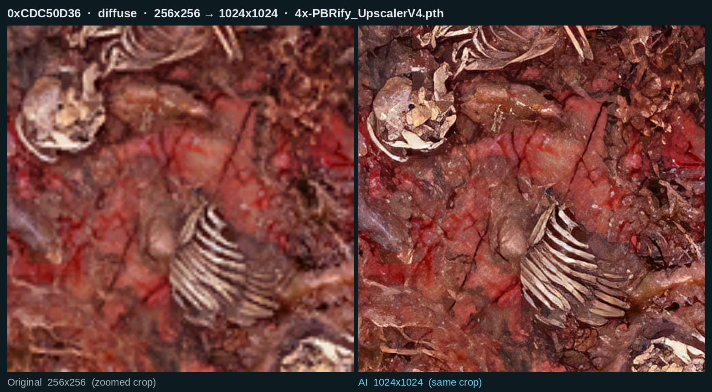<br><sub>Carne e osso de necromorfo, 256×256 → 1024×1024. O gore é onde o modelo brilha: cada tendão e costela ganha estrutura de verdade.</sub></p>
<p align="center">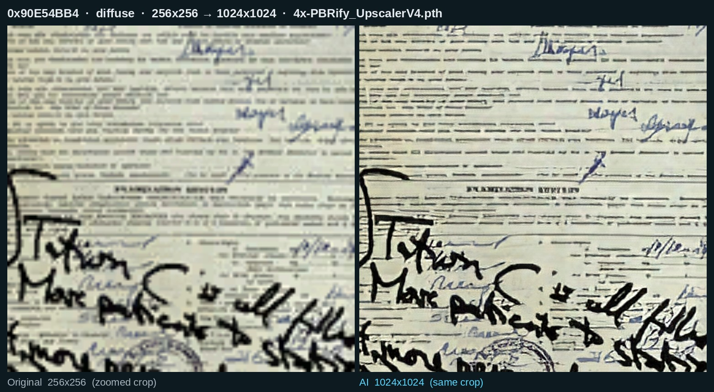<br><sub>Documento manuscrito, 256×256 → 1024×1024. As linhas datilografadas e os traços de caneta ficam legíveis.</sub></p>
<p align="center">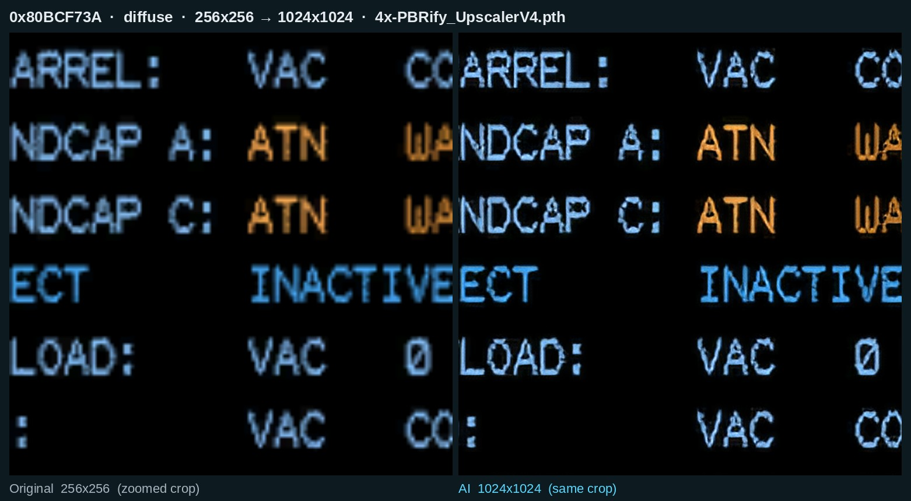<br><sub>Tela de terminal, 256×256 → 1024×1024. O texto pixelado vira glifo limpo sem trocar a fonte.</sub></p>
<p align="center">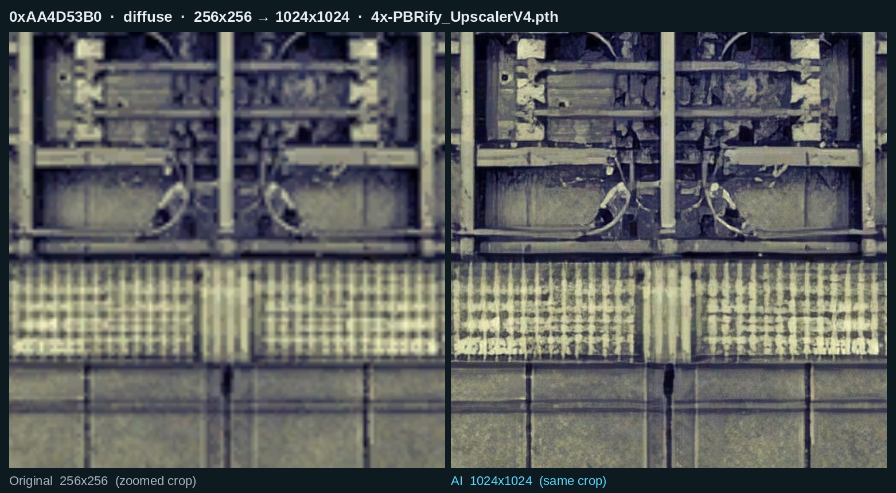<br><sub>Parede de metal com grades, 256×256 → 1024×1024. Rebites, sujeira e respiros deixam de ser borrão.</sub></p>
<p align="center">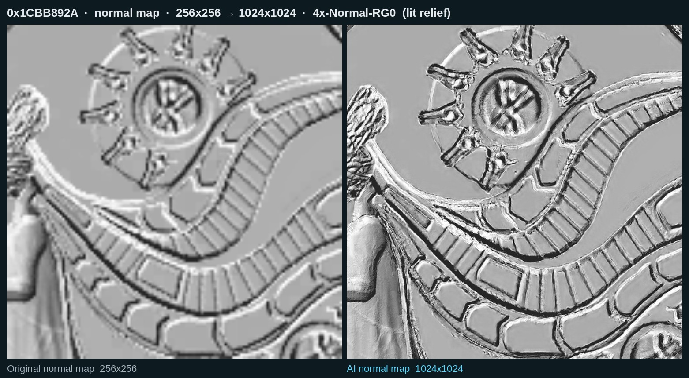<br><sub>Normal map de um relevo da Unitologia, 256×256 → 1024×1024, renderizado com luz para mostrar o relevo. Normal maps passam por um modelo próprio (4x-Normal-RG0), nunca por upscaler de foto.</sub></p>
<p align="center">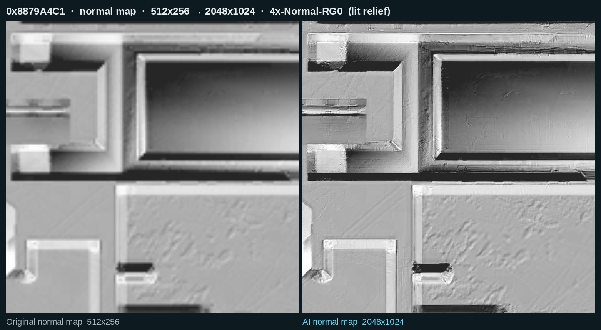<br><sub>Normal map de um painel de máquina, 512×256 → 2048×1024, iluminado. Chanfros e parafusos voltam como relevo de verdade.</sub></p>

<details>
<summary><b>Mais comparações</b> (mais 9: pôsteres, etiquetas, vitral, canos, tecido e mais quatro normal maps)</summary>
<br>

<p align="center">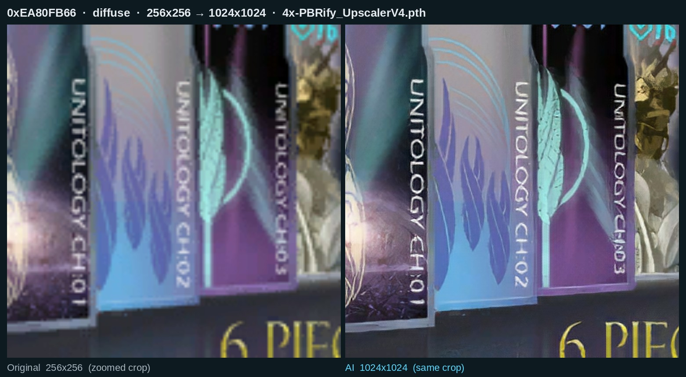<br><sub>Pôsteres da Unitologia, 256×256 → 1024×1024.</sub></p>
<p align="center">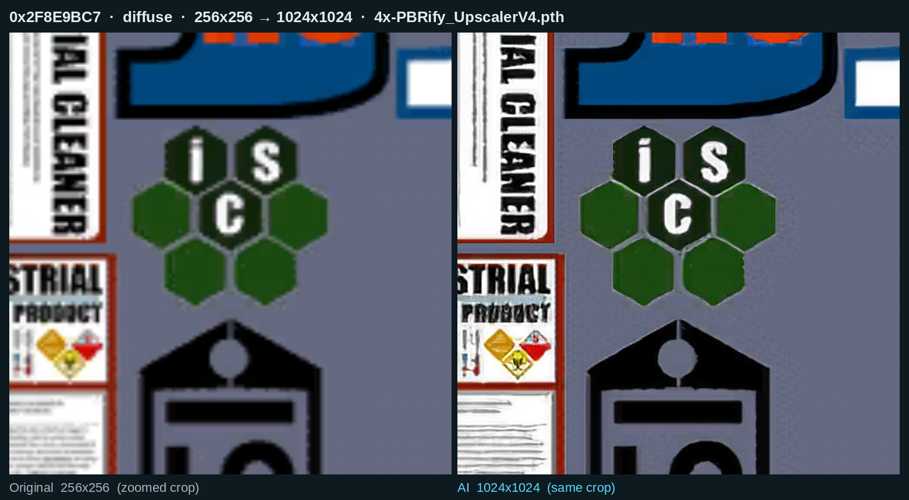<br><sub>Etiqueta de produto de limpeza industrial, 256×256 → 1024×1024.</sub></p>
<p align="center">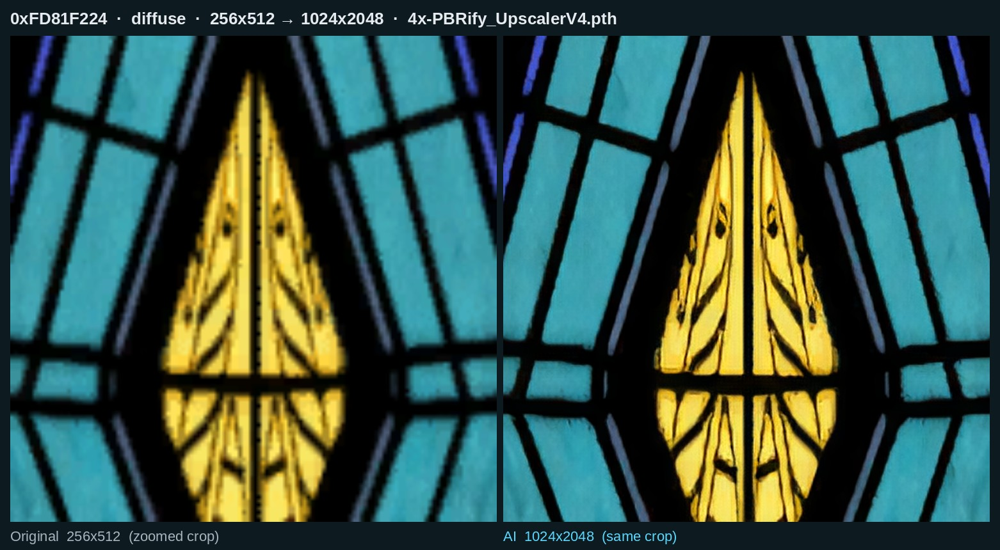<br><sub>Vitral, 256×512 → 1024×2048.</sub></p>
<p align="center">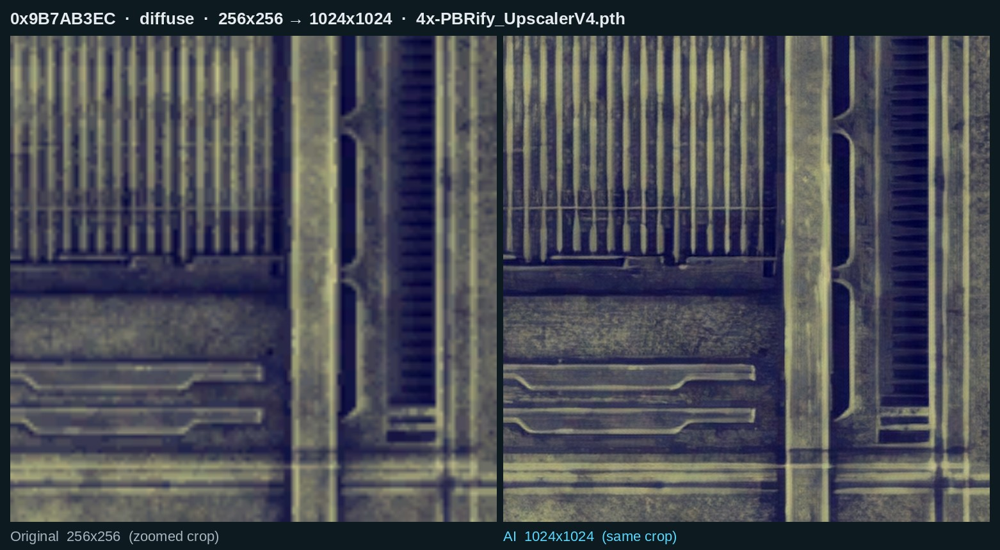<br><sub>Canos e condutes, 256×256 → 1024×1024.</sub></p>
<p align="center">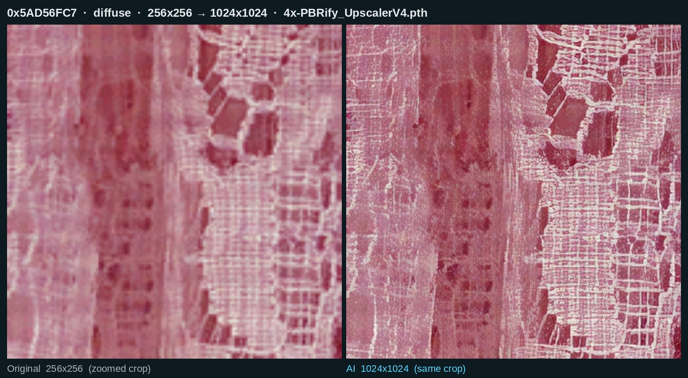<br><sub>Tecido vermelho, 256×256 → 1024×1024.</sub></p>
<p align="center">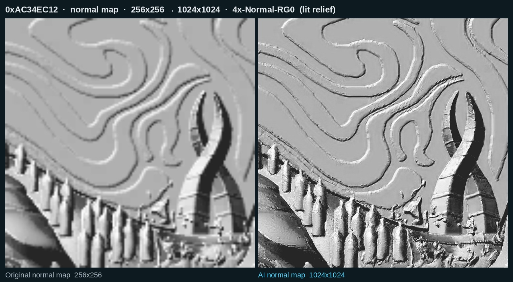<br><sub>Normal map, ornamento em espiral, iluminado.</sub></p>
<p align="center">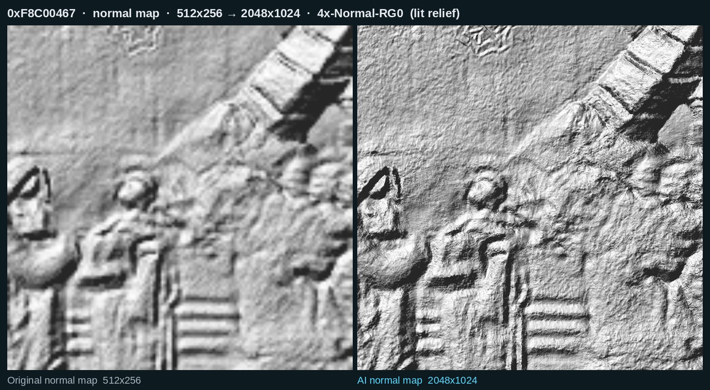<br><sub>Normal map, figuras em relevo, 512×256 → 2048×1024, iluminado.</sub></p>
<p align="center">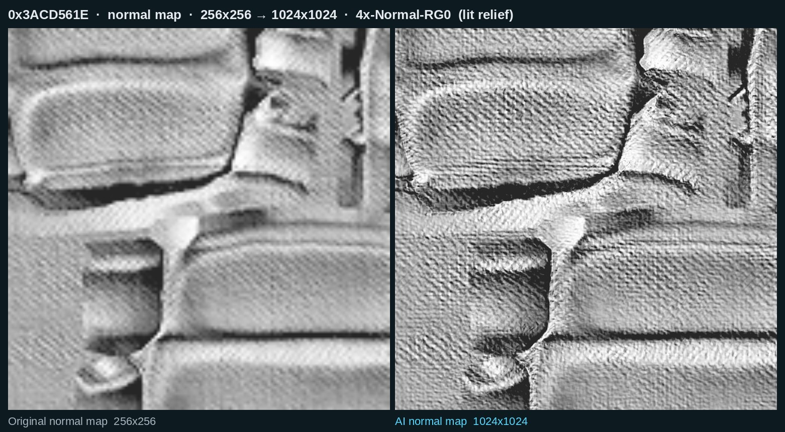<br><sub>Normal map, painéis volumosos, iluminado.</sub></p>
<p align="center">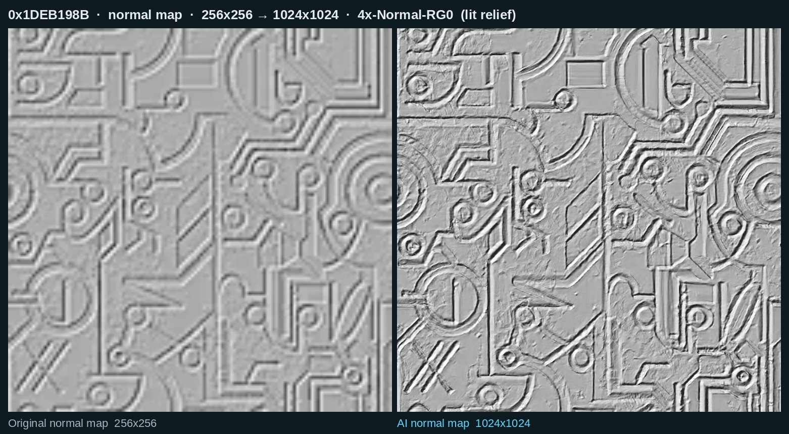<br><sub>Normal map, trilhas de circuito, iluminado.</sub></p>

</details>

**Quantas texturas são?** Zerar a campanha entrega cerca de **15.000 texturas únicas**. A rodada padrão remasteriza **14.400** delas (o resto são tiras de 1 a 7 pixels, preenchimentos de cor única e texturas que os seus `.tpf` já cobrem). Por tipo, na rodada que gerou as imagens acima:

| Tipo | Texturas | O que foi feito |
|---|---:|---|
| Cor (diffuse) | 4.764 | 4x com PBRify_UpscalerV4, ou UltraSharp quando a checagem de invenção reprova |
| Máscaras, specular, mapas de luz | 5.982 | 2x, reamostragem cuidadosa |
| Normal maps | 1.515 | 4x com 4x-Normal-RG0 |
| Degradês lisos | 1.198 | 4x por reamostragem, sem IA (não há o que recuperar) |
| Luzes, brilhos, fumaça | 822 | 4x com UltraSharp |

Até 4096 px de lado, mipmaps completos, **18 GB** em disco, cerca de 9 horas numa Intel Arc B580.

---

## Não quer rodar a IA? Baixe o pacote pronto

O pacote da rodada acima está na página de [**Releases**](https://github.com/sidnei-almeida/dead-space-2-ai-remaster/releases/latest): 14.400 texturas, 18 GB, divididos em partes de menos de 2 GB por causa do limite de tamanho do GitHub. Você precisa de uns **36 GB livres** (o pacote mais o cache que o DS2TexInject monta a partir dele), e não precisa de GPU.

> **O Return to Titan é obrigatório.** Este pacote foi feito como complemento do mod de texturas *Return to Titan*: as 250 texturas que ele já cobre (e os pacotes de trajes 4K) ficaram de fora de propósito, então sem ele essas continuam originais. Instale os `.tpf` do Return to Titan na pasta `texmod` antes.

1. Instale o [DS2TexInject](https://github.com/sidnei-almeida/dead-space-2-texmod-linux) e abra o jogo uma vez.
2. Baixe **todas** as partes `zz_ai_remaster.zip.0NN` e o `zz_ai_remaster.sha256` para a pasta `texmod` do jogo.
3. Junte as partes, confira e monte o cache, com o jogo fechado:

```sh
cd "$HOME/.local/share/Steam/steamapps/common/Dead Space 2/texmod"
cat zz_ai_remaster.zip.0* > zz_ai_remaster.zip && rm zz_ai_remaster.zip.0*
sha256sum -c zz_ai_remaster.sha256          # opcional, leva um minuto
python3 ../DS2TexInject/ds2tex.py .
```

4. Jogue. **F10** alterna entre original e remaster. Seus pacotes `.tpf` sempre têm prioridade sobre este.

O pacote é compartilhado sob **CC BY-NC-SA 4.0** (um dos modelos exige, veja [Licença](#licença)): crédito, mesma licença, nunca vendido.

---

## Resumo rápido

| Passo | O que fazer |
|:---:|---|
| 1 | Instalar o **[DS2TexInject](https://github.com/sidnei-almeida/dead-space-2-texmod-linux)**. É ele que coloca as texturas no jogo. |
| 2 | Clonar este repositório e rodar **`./remaster.sh setup`**. |
| 3 | Rodar **`./remaster.sh dump-on`** e **jogar** um pouco. O jogo entrega as texturas dele. |
| 4 | Fechar o jogo, rodar **`./remaster.sh`** e escolher **Remasterizar**. Vá tomar um café. |
| 5 | **Jogar.** Aperte **F10** para comparar antes e depois. |

Cada passo está explicado abaixo. Ou pule a IA e [baixe o pacote pronto](#não-quer-rodar-a-ia-baixe-o-pacote-pronto).

---

## O menu

Não curte digitar comandos? É só rodar:

```sh
./remaster.sh
```

e um menu abre. Escolha com as setas e aperte Enter:

```
  DEAD SPACE 2  AI TEXTURE REMASTER
  ────────────────────────────────────────────────────

  Jogo                 ○ fechado
  Remaster no jogo     ● ativo (1.3G)
  Coleta               ● LIGADA (o jogo salva cada textura nova)
  Ultima rodada        as 22:17, levou 2 min

  Texturas coletadas   5292
  Ja remasterizadas    3458
  Puladas              831  (pequenas demais ou de cor unica)
  Dos seus mods        86  (seus .tpf ja cuidam delas)
  Esperando            917 novas, ainda nao processadas
  Modelo               PBRify_UpscalerV4 + UltraSharp nas luzes + Normal-RG0 no relevo, 4x, ate 4096px

  O que voce quer fazer? (setas + Enter, Esc sai)
  ➜ ▶  Jogar Dead Space 2
    ✦  Remasterizar as texturas novas (917 esperando)
    ◉  Desligar a coleta de texturas (agora esta LIGADA)
    ◐  Desativar o remaster no jogo (agora esta ATIVO)
    ⇄  Comparar original x IA (abre no navegador)
    ≡  Ver o log da ultima rodada
    ⚙  Instalar ou consertar o ambiente
    ?  Ajuda
    ✕  Sair
```

Durante a remasterização, um painel ao vivo mostra cada etapa, uma barra de progresso, o tempo restante e quantas texturas de cada tipo já foram feitas:

```
  ✔  Ler as texturas coletadas
  ⠹  Remasterizar com IA (PBRify_UpscalerV4 + UltraSharp nas luzes + Normal-RG0 no relevo)
  ·  Gerar DDS com mipmaps
  ·  Montar o pacote
  ·  Instalar no jogo

  ██████████████░░░░░░░░░░░░░░░░░░░░   43.2%   396 / 917 texturas
  decorrido 1m12s   faltam ~1m35s   erros 0
  cor 201   mascaras 160   normal maps 35

  Ctrl+C cancela (o que ja foi feito fica salvo)
```

O painel mostra a situação atual com cores, as opções de ligar e desligar dizem o que vão fazer, e **▶ Jogar** abre o jogo pelo Steam. Tudo o que está abaixo dá para fazer pelo menu. O `./remaster.sh --help` explica cada comando.

---

## Passo 1: Instalar o DS2TexInject

Este projeto cria as texturas. O **[DS2TexInject](https://github.com/sidnei-almeida/dead-space-2-texmod-linux)** é o plugin que coloca elas no jogo, e também é ele que coleta as texturas originais para a IA.

<a href="https://github.com/sidnei-almeida/dead-space-2-texmod-linux"></a>

Siga o guia dele até o jogo rodar com o plugin. Os pacotes `.tpf` são opcionais, mas se você tiver, eles são respeitados.

## Passo 2: Instalar esta ferramenta

```sh
git clone https://github.com/sidnei-almeida/dead-space-2-ai-remaster
cd dead-space-2-ai-remaster
./remaster.sh setup
```

O `setup` cria um ambiente Python em `.venv`, instala o PyTorch e o [spandrel](https://github.com/chaiNNer-org/spandrel), baixa os modelos de IA que faltam, encontra o jogo e mostra qual GPU encontrou:

```
Dead Space 2 encontrado em: /home/voce/.local/share/Steam/steamapps/common/Dead Space 2
DS2TexInject: instalado em /home/voce/.local/share/Steam/steamapps/common/Dead Space 2
GPU: Intel(R) Arc(TM) B580 Graphics
```

**A pasta do jogo é encontrada sozinha.** Ele procura em todas as bibliotecas da Steam (nativa, Flatpak e Snap), no Heroic (GOG, Epic e jogos adicionados à mão), no Lutris, no Bottles e nos prefixos do Wine. Se não achar, varre o disco inteiro. Se achar mais de uma cópia, pergunta qual você joga. A escolha fica guardada em `.game-path`. Para trocar depois:

```sh
./remaster.sh game                              # procura de novo em todos os discos
./remaster.sh game "/onde/esta/Dead Space 2"    # ou informe a pasta
```

**Os modelos também são baixados sozinhos.** Se algum `.pth` sumir de `models/`, a próxima rodada baixa de novo antes de começar. Um download interrompido continua de onde parou.

> **Intel Arc:** o PyTorch também precisa do driver de computação da Intel. No Arch: `sudo pacman -S intel-compute-runtime level-zero-loader`
>
> **NVIDIA:** troque a linha do PyTorch em `cmd_setup`, dentro do `remaster.sh`, pelo `pip install torch torchvision` normal.
>
> **Sem GPU compatível:** ele usa a CPU. Funciona, só que bem mais devagar.

## Passo 3: Coletar as texturas

A IA trabalha nas texturas exatamente como o jogo usa, então o jogo precisa entregar elas:

```sh
./remaster.sh dump-on
```

Agora **jogue normalmente.** Cada textura que aparece na tela é salva uma vez em `texmod/_dump/`. O jogo pode dar umas engasgadas enquanto salva.

Não precisa terminar o jogo. A maioria das texturas (interface, Isaac, armas, Necromorfos, paredes comuns) carrega nos primeiros minutos, e depois disso só áreas novas acrescentam mais. Nos testes, **25 minutos de jogo deram 4.375 texturas.** Saves de cada capítulo são um jeito rápido de passar por todas as áreas.

Quando terminar:

```sh
./remaster.sh dump-off
```

## Passo 4: Remasterizar

Feche o jogo, abra o menu (`./remaster.sh`) e escolha **Remasterizar as texturas novas**, ou rode direto:

```sh
./remaster.sh run
```

Só isso. Uma barra de progresso fica se atualizando na tela. Ele lê o dump, roda a IA, gera os DDS, monta o pacote e instala no jogo. Pode deixar rodando sozinho:

- ⏱️ **A primeira rodada demora** (de 15 a 30 minutos numa Intel Arc B580). As próximas só processam as texturas novas do dump.
- 🔁 **Pare quando quiser** com Ctrl+C. Rode de novo e ele continua de onde parou.
- 🛡️ **Se a GPU travar**, ele percebe a falta de progresso, reinicia e segue.
- 🎮 **Se você abrir o jogo no meio**, ele para, em vez de disputar a GPU com o jogo.
- 🔔 **Uma notificação** avisa quando termina.

Acompanhe de outro terminal:

```
$ ./remaster.sh status
upscale [#########...........] 46.2%  1422/3079
decorrido 31m05s | faltam ~36m12s | erros 0 | modelo 4x-PBRify_UpscalerV4.pth
por classe: diffuse 702, mask 611, normal_ag 109
situacao: RODANDO
```

## Passo 5: Jogar

Abra o Dead Space 2 pelo Steam, normalmente.

- Aperte **F10** para alternar entre as texturas originais e as remasterizadas.
- Chegue perto de paredes, chão e portas com a lanterna ligada. É ali que a diferença aparece.

---

## Todos os comandos

| Comando | O que faz |
|---|---|
| `./remaster.sh` | Abre o menu. Sem terminal (em segundo plano, agendado), faz o mesmo que `run`. |
| `./remaster.sh run` | Processa as texturas novas e instala o resultado no jogo. |
| `./remaster.sh status` | Progresso, tempo restante e erros de uma rodada em andamento. |
| `./remaster.sh preview` | Gera uma página com o original e a IA lado a lado, para achar e rejeitar resultados ruins. |
| `./remaster.sh dump-on` / `dump-off` | Liga ou desliga a coleta de texturas enquanto você joga. |
| `./remaster.sh off` | Desativa o remaster (ficam só os seus `.tpf`). |
| `./remaster.sh on` | Ativa de novo. |
| `./remaster.sh setup` | Instala ou conserta o ambiente, baixa os modelos que faltam e confere o DS2TexInject. |
| `./remaster.sh game [pasta]` | Procura o jogo de novo em todos os discos, ou usa a pasta informada. |

## Configurações

Ficam no topo do `remaster.sh`:

| Configuração | Padrão | O que faz |
|---|---|---|
| `MODEL` | `4x-PBRify_UpscalerV4` | Qualquer modelo que o [spandrel](https://github.com/chaiNNer-org/spandrel) carregue: ESRGAN, SPAN, DAT, HAT... Veja a [OpenModelDB](https://openmodeldb.info). |
| `SCALE` | `4` | Fator de aumento para texturas de cor e normal maps. |
| `MASK_SCALE` | `2` | Fator para máscaras, specular e mapas de luz. Ganham pouco e ocupam muita memória. |
| `MAX_SIZE` | `4096` | Lado máximo de qualquer textura. |
| `GLOW_MODEL` | `4x-UltraSharp` | Modelo para luzes, brilhos, fachos e fumaça (classe `glow`), e para qualquer textura em que o modelo principal inventar detalhe que não existia. `GLOW_MODEL=` desliga os dois. |
| `NORMAL_MODEL` | `4x-Normal-RG0` | Modelo para normal maps, treinado só em normal maps. `NORMAL_MODEL=` volta para reamostragem Lanczos. |
| `SOFT_MODEL` | vazio | Segundo modelo opcional, mais conservador (ex.: `models/4x-UltraSharp.pth`), para texturas de pouco detalhe. |
| `GAME` | encontrada sozinha | Pasta do jogo. Normalmente não precisa: ela é descoberta e guardada em `.game-path`. |
| `WORK` | `work/pbrify4x` | Pasta de trabalho (`work/pbrify<SCALE>x`). Troque quando trocar de modelo, para os resultados não se misturarem. |

---

## Problemas comuns

| Problema | Solução |
|---|---|
| **`GPU: NAO ENCONTRADA`** | O PyTorch não está vendo a GPU. Na Intel Arc, instale `intel-compute-runtime` e `level-zero-loader`. |
| **O jogo fecha ao entrar em áreas novas ou depois de muito tempo** | O Dead Space 2 é um programa de 32 bits e pode ficar sem memória. Diminua `MAX_SIZE` para `1024` e rode o `./remaster.sh run` de novo, ou coloque `Pool=default` no `DS2TexInject.ini`. |
| **Alguma textura ficou estranha** | Aperte **F10** para confirmar. Rode `./remaster.sh preview`, abra a página que ele mostra, ache a textura e coloque o hash dela em `work/pbrify4x/rejected.txt`. A próxima rodada deixa ela de fora. |
| **O jogo engasga ao entrar em áreas novas** | Confira se o DS2TexInject está atualizado e se o Pillow está instalado (`sudo pacman -S python-pillow`), depois rode `./remaster.sh on`. As texturas passam a ser carregadas já prontas. |
| **Qualquer outra coisa** | Veja o `work/pbrify4x/remaster.log` e abra uma issue com ele. |

<p align="center"><a href="https://github.com/sidnei-almeida/dead-space-2-ai-remaster/issues"></a></p>

---

## Como funciona

Você não precisa desta parte para usar a ferramenta.

```
o jogo (DumpTextures=1) ──► texmod/_dump/0xHASH.dds        texturas originais, com o hash do TexMod no nome
        │
        ▼  scan        classifica cada textura: cor, normal map, máscara, pequena demais, cor única
        ▼  upscale     IA nas texturas de cor e nos normal maps; redimensionamento cuidadoso em máscaras
        ▼  encode      volta ao formato original (DXT1, DXT5, ARGB) com todos os mipmaps
        ▼  pack        texmod/zz_ai_remaster.zip  (+ texmod.def)
        ▼  ds2tex.py   texmod/_cache, onde o DS2TexInject encontra durante o jogo
```

**Cada tipo de textura tem um tratamento próprio:**

| Tipo | O que acontece |
|---|---|
| Cor (diffuse) | IA com bordas espelhadas, para texturas que se repetem não ganharem costura, e depois a trava de cor: as baixas frequências vêm do original, então cores e iluminação continuam fiéis. |
| Normal map (DXT5nm: X no alpha, Y no verde) | Nunca passa por modelo de foto. Passa por um modelo treinado só em normal maps (`NORMAL_MODEL`, 4x-Normal-RG0), é renormalizado, e os canais vermelho e azul, que não são usados, ficam como o jogo espera. |
| Máscaras, specular, mapas de luz | Redimensionamento limpo. A IA criaria costuras entre os retalhos dos mapas de luz. |
| Alpha | Aumentado separadamente. Em DXT1 volta a ser recorte de 1 bit (grades, folhagem). |
| Suaves (degradês puros) | Só redimensionamento limpo. Não há detalhe para recuperar, e os modelos de IA inventam textura nelas: anéis e rugas que aparecem no facho da lanterna. |
| Luzes, brilhos, fachos, fumaça e poeira (`glow`) | Formas suaves com pouco detalhe fino. O PBRify endurece as bordas e enche de chuvisco, então essas vão para o `GLOW_MODEL` (UltraSharp), que respeita o degradê. |
| Qualquer textura, depois do modelo principal | Checagem anti-invenção: o resultado é reduzido de volta ao tamanho do original e o detalhe fino dele é comparado com o do original. Perto de 1.0 é fiel; acima de `--invent-max` (1.15) o modelo inventou textura, e essa é refeita com o `GLOW_MODEL`. O `recheck` aplica o mesmo teste aos resultados de rodadas anteriores. |
| Qualquer textura, regiões chapadas | Uma trava local: onde o original é degradê puro (o fundo liso de uma placa, o brilho em volta de uma luz) a IA é desligada aos poucos e entra o redimensionamento limpo. Caixas, paredes lisas e plástico continuam recebendo a IA inteira. `--detail-lo`/`--detail-hi` ajustam, `--no-detail-guard` desliga. |
| Pequenas ou de cor única | Puladas. Não há o que ganhar. |

**Por que as texturas originais vêm do jogo rodando:** o DS2TexInject identifica cada textura pelo hash CRC32 dos bytes que o jogo envia ao Direct3D. Com o dump em tempo real, cada arquivo já sai com o nome certo. Tirar dos arquivos `.DAT` da EA exigiria descobrir o formato deles e ainda reproduzir exatamente o mesmo hash.

**Por que os mipmaps importam:** sem eles, o plugin geraria os mipmaps na primeira vez que cada textura aparece, no meio do jogo. Dezenas de texturas de 2048px de uma vez derrubavam o jogo de 100 para 40 FPS ao entrar numa área nova. Entregar os mipmaps prontos elimina esse trabalho.

<details>
<summary><b>Usar o <code>ds2remaster.py</code> direto</b></summary>

O `remaster.sh` chama o `ds2remaster.py`, que também pode rodar etapa por etapa:

```sh
.venv/bin/python ds2remaster.py all --model models/4x-PBRify_UpscalerV4.pth --limit 20
```

| Opção | Padrão | O que faz |
|---|---|---|
| `--model` | nenhum | Modelo de upscale. Sem ele, usa Lanczos (serve para testar o pipeline). |
| `--cleanup` | nenhum | Modelo 1x opcional aplicado antes, para limpar artefatos de compressão. |
| `--scale` / `--mask-scale` | 2 | Fatores de aumento. |
| `--max-size` | 2048 | Lado máximo de qualquer textura. |
| `--tile` | 544 | Tamanho de cada bloco na GPU. Uma textura de 1024px vira 4 blocos. Na Intel Arc, blocos de 1088px causaram erros na GPU. |
| `--only` | todas | Só alguns tipos: `diffuse`, `normal`, `normal_ag`, `mask`. |
| `--recent N` | todas | Só as texturas salvas nos últimos N minutos de jogo. Ótimo para testar uma área. |
| `--limit N` | todas | No máximo N texturas. |
| `--pack-name` | `zz_ai_remaster.zip` | Nome do pacote (precisa terminar em `.zip` e conter `_ai_`). |
| `--ai-alpha` | não | Passa também o canal alpha pela IA. |
| `--no-ai-masks` | não | Máscaras e specular só com redimensionamento, sem IA. |
| `--glow-model` | nenhum | Modelo para a classe `glow` (luzes, brilhos, fumaça) e para os resultados reprovados na checagem anti-invenção. |
| `--invent-max` | `1.15` | Acima deste tanto de detalhe inventado, o resultado do modelo principal é trocado pelo `--glow-model`. `--no-invent-check` desliga a checagem. |
| `--soft-model` | nenhum | Segundo modelo, conservador, para texturas com pouco detalhe no total (`--soft-below`, padrão 0.016). |
| `--no-color-lock` | não | Deixa a IA mudar as cores. |
| `--force` | não | Refaz o que já existe. |

Etapas: `scan`, `recheck`, `upscale`, `encode`, `pack`, `preview`, `all`, `status`. O `preview` gera o `work/preview.html` com o original e a IA lado a lado, mais o modelo usado e a medida de invenção de cada textura.
</details>

---

## Créditos

- **[4x-PBRify_UpscalerV4](https://openmodeldb.info/models/4x-PBRify-UpscalerV4)**, do Kim2091: o modelo padrão (DAT2, roda em bf16).
- **[4x-UltraSharp](https://openmodeldb.info/models/4x-UltraSharp)**, do Kim2091: cuida das luzes, brilhos e fumaça (`GLOW_MODEL`), onde o PBRify inventa textura.
- **[4x-Normal-RG0](https://openmodeldb.info/models/4x-Normal-RG0)**, do RunDevelopment: aumenta os normal maps (`NORMAL_MODEL`), o maior ganho de profundidade de todos.
- **[spandrel](https://github.com/chaiNNer-org/spandrel)**, da equipe do chaiNNer: carrega quase qualquer arquitetura de upscale.
- **[OpenModelDB](https://openmodeldb.info)**: o catálogo de modelos da comunidade.
- **[DS2TexInject](https://github.com/sidnei-almeida/dead-space-2-texmod-linux)**: coleta as texturas originais e carrega as remasterizadas.

**Testado em:** Arch Linux, Intel Arc B580 (PyTorch XPU), GE-Proton 11, DXVK, ReShade e MarkerPatch.

## Licença

[MIT](LICENSE). Os modelos de IA não fazem parte deste projeto e têm as próprias licenças: o 4x-PBRify_UpscalerV4 e o 4x-Normal-RG0 são CC0, então pacotes feitos só com eles podem ser compartilhados livremente. O 4x-UltraSharp é CC BY-NC-SA 4.0, e a configuração padrão usa ele nas luzes e brilhos: pacotes feitos com o padrão podem ser compartilhados com crédito, sob a mesma licença e nunca vendidos. Rode com `GLOW_MODEL=` para um pacote só com o PBRify. Confira a licença de qualquer outro modelo antes de compartilhar pacotes feitos com ele. O Dead Space 2 e as texturas dele pertencem à Electronic Arts.
